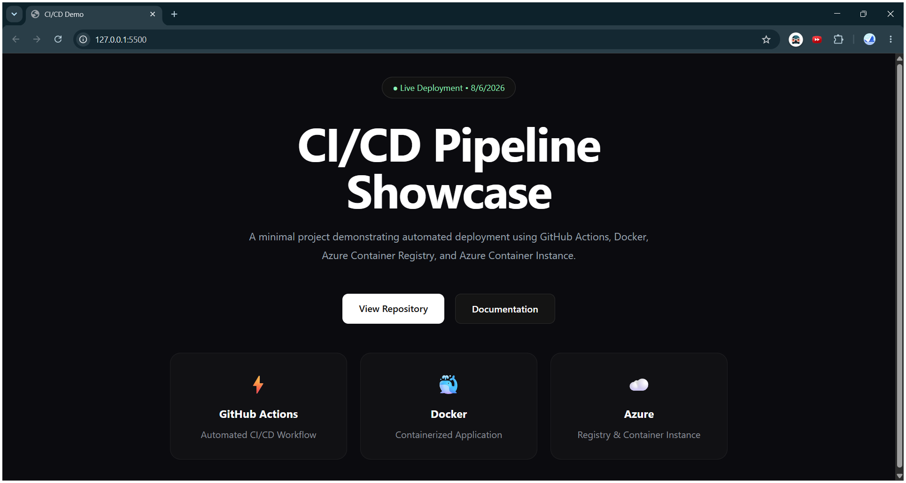
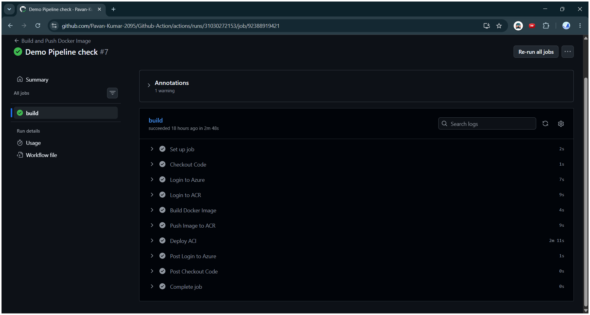
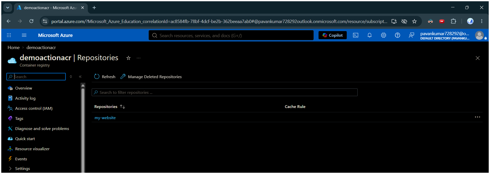
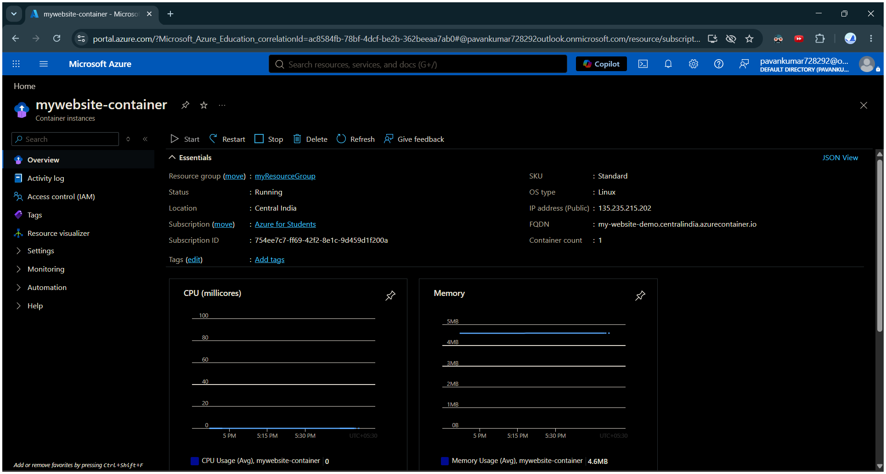

# GitHub Action

A complete CI/CD pipeline for deploying a Dockerized web application using GitHub Actions, Docker, Azure Container Registry (ACR), and Azure Container Instance (ACI).

This project demonstrates how modern DevOps practices can automate the process of building, storing, and deploying applications. When new code is pushed to GitHub, the pipeline automatically creates a Docker image, stores it in Azure Container Registry, and deploys the application to Azure Container Instance.

---

# What is This Project?

In traditional application deployment, developers manually build applications, create deployment packages, upload files to servers, and restart services.

This project automates that process using a CI/CD pipeline.

**CI/CD (Continuous Integration and Continuous Deployment)** is a software development practice where:

- Code changes are automatically tested and built.
- Application packages are created automatically.
- New versions are deployed without manual steps.

In this project:

- GitHub Actions works as the automation engine.
- Docker packages the application into a container.
- Azure Container Registry stores Docker images.
- Azure Container Instance runs the container in the cloud.

---

# Architecture

```text
Developer

    |
    | Push Code
    ▼

GitHub Repository

    |
    | Trigger Workflow
    ▼

GitHub Actions

    |
    | Build Docker Image
    ▼

Azure Container Registry

    |
    | Pull Latest Image
    ▼

Azure Container Instance

    |
    ▼

Nginx Web Server

    |
    ▼

Live Website
```

---

# How the Deployment Works

1. A developer pushes new code to the GitHub repository.

2. GitHub Actions automatically starts the workflow.

3. The workflow downloads the latest source code.

4. Docker builds a new image containing the application.

5. The Docker image is uploaded to Azure Container Registry.

6. Azure Container Instance downloads the image and starts a new container.

7. The updated website becomes available.

The complete deployment happens automatically after a Git push.

---

# Screenshots

## Application

Add screenshot of the deployed website.

```
assets/application.png
```




## GitHub Actions Workflow

Add screenshot showing successful pipeline execution.

```
assets/github-actions.png
```




## Azure Container Registry

Add screenshot showing stored Docker images.

```
assets/acr.png
```




## Azure Container Instance

Add screenshot showing running container.

```
assets/aci.png
```



---

# Features

- Automated deployment triggered by Git push
- Docker-based application deployment
- Cloud container hosting using Azure
- Private Docker image storage using Azure Container Registry
- Versioned Docker images using Git commit SHA
- Secure Azure authentication using GitHub Secrets

---

# Technology Stack

| Technology | Role |
|------------|------|
| HTML/CSS/JavaScript | Web application |
| Docker | Application containerization |
| Nginx | Web server |
| GitHub Actions | CI/CD automation |
| Azure Container Registry | Docker image storage |
| Azure Container Instance | Cloud container hosting |
| Azure CLI | Azure management |

---

# Project Structure

```text
Github-Action/

├── .github/
│   └── workflows/
│       └── build.yml

├── assets/
│   ├── application.png
│   ├── github-actions.png
│   ├── acr.png
│   └── aci.png

├── Dockerfile
├── index.html
├── style.css
├── script.js
└── README.md
```

---

# Getting Started

## Prerequisites


- Git
- Docker Desktop
- Azure CLI
- GitHub Account
- Azure Subscription

---

## Clone Repository

```bash
git clone https://github.com/Pavan-Kumar-2095/Github-Action.git

cd Github-Action
```

---

## Run Application Locally

Build the Docker image:

```bash
docker build -t my-website .
```

Start the container:

```bash
docker run -p 8080:80 my-website
```

Open:

```
http://localhost:8080
```

---

# Azure Setup

The deployment requires the following Azure resources:

## Azure Container Registry (ACR)

Azure Container Registry is a private registry used to store Docker images.

The workflow pushes application images here before deployment.

Example:

```
demoactionacr.azurecr.io/my-website:<version>
```

---

## Azure Container Instance (ACI)

Azure Container Instance runs the Docker container directly in Azure without requiring virtual machines or Kubernetes management.

The container:

- Runs Linux
- Uses Nginx
- Exposes port 80
- Automatically restarts if stopped

---

# GitHub Actions Configuration

The workflow file is located at:

```
.github/workflows/build.yml
```

The workflow requires Azure credentials stored as GitHub Repository Secrets.

Required secrets:

| Secret | Purpose |
|--------|---------|
| AZURE_CLIENT_ID | Azure authentication |
| AZURE_CLIENT_SECRET | Azure authentication |
| AZURE_SUBSCRIPTION_ID | Azure subscription |
| AZURE_TENANT_ID | Azure tenant |
| RESOURCE_GROUP | Azure resource group |
| ACR_NAME | Container registry name |
| ACR_LOGIN_SERVER | Registry URL |
| ACR_USERNAME | Registry login |
| ACR_PASSWORD | Registry password |
| ACI_NAME | Container instance name |

---
# Final Words

This project demonstrates an end-to-end CI/CD workflow for deploying a containerized web application using **GitHub Actions**, **Docker**, and **Microsoft Azure services**.

It showcases practical experience with:

- Cloud Infrastructure and Azure Services
- CI/CD Pipeline Automation
- Containerization using Docker
- Cloud-based Application Deployment
- DevOps Practices and Workflow Automation

The project provides a foundation for extending the deployment process with advanced capabilities such as monitoring, security scanning, Kubernetes-based orchestration, and production-grade release strategies.

---

If you find this project useful or interesting, consider giving it a star on GitHub.

---

# Author

**Pavan Kumar**

GitHub: https://github.com/Pavan-Kumar-2095  
LinkedIn: https://www.linkedin.com/in/pavan-kumar-107655297/  
LeetCode: https://leetcode.com/u/Pavan_Kumar-7070/